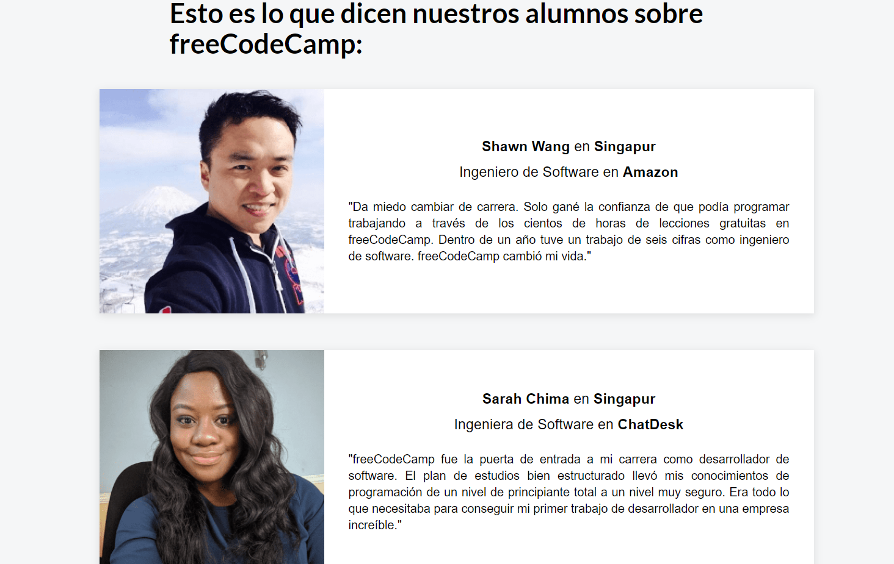

# Proyecto #1 React - Sección Testimonios - freeCodeCamp.org 

Este proyecto fue realizado con  [Create React App](https://github.com/facebook/create-react-app), como práctica para el aprendizaje de esta biblioteca en freeCodeCamp.org.

## Descripción del proyecto
Clon de la seccíon testimonios del sitio web de [freeCodeCamp.org](https://www.freecodecamp.org/espanol/)

## Temas de estudio:
* Estructura de un proyecto en React.
* Componentes.
* Importar y exportar componentes.
* Propiedades: props.

## Acerca del autor:
* [LinkedIn](https://www.linkedin.com/in/carlos-munera-259969262 "Linkedin")